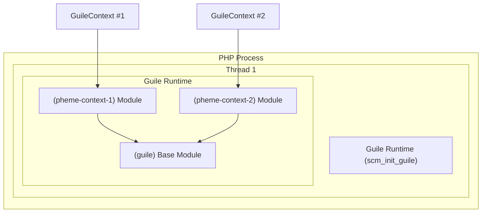

# Pheme

Pheme is a PHP 8.5 extension that allows you to use Scheme inside your PHP applications, using GNU Guile as the embedded Scheme interpreter.

## Disclaimer ⚠️

This extension was almost entirely vibecoded (Kilo Code/MiniMax M2.1) for my own hobbyist needs, use it in **production at your own risk**.

## Overview

Pheme provides a `GuileContext` class that enables PHP developers to:

- Evaluate Scheme code directly from PHP
- Create isolated execution contexts for safe code evaluation
- Leverage Scheme's powerful functional programming features within PHP
- Share data between PHP and Scheme environments

## Requirements

- PHP 8.5 or higher
- GNU Guile 2.0 or higher (3.0 recommended)
- GCC or compatible C compiler
- GNU Autoconf

## Installation

### Prerequisites

Install Guile using your system's package manager:

**macOS (Homebrew):**
```bash
brew install guile
```

**Ubuntu/Debian:**
```bash
sudo apt-get install guile-3.0 guile-3.0-dev
```

**Fedora/RHEL:**
```bash
sudo dnf install guile guile-devel
```

### Installing via PIE (Recommended)

You can install Pheme using [PIE](https://github.com/php/pie):

```bash
pie install capotej/pheme
```

### Installing via PECL

You can also install Pheme using PECL:

```bash
pecl install capotej/pheme
```

### Building the Extension

```bash
# Navigate to the extension directory
cd /path/to/pheme

# Generate configure script (if needed)
phpize

# Configure with Guile support
./configure --enable-pheme

# Build
make

# Run tests
make test TESTS=tests/

# Install (requires root)
sudo make install
```

### Enabling the Extension

Add the following to your `php.ini` file:

```ini
extension=pheme.so
```

Verify the extension is loaded:

```bash
php -m | grep pheme
php -r "echo phpinfo();" | grep -A5 "pheme"
```

## Usage

### Basic Example

```php
<?php
// Create a new Guile context
$ctx = new GuileContext();

// Evaluate Scheme code
$result = $ctx->eval("(+ 1 2 3)");
echo $result; // Output: 6

// Define a Scheme function and use it
$ctx->eval("(define (factorial n) (if (= n 0) 1 (* n (factorial (- n 1)))))");
$factorial = $ctx->eval("(factorial 5)");
echo $factorial; // Output: 120

// Clean up
$ctx->free();
?>
```

### Working with Lists and Data Structures

```php
<?php
$ctx = new GuileContext();

// Create a list in Scheme
$ctx->eval("(define my-list '(1 2 3 4 5))");

// Use SRFI-1 list operations
$ctx->eval("(use-modules (ice-9 list))");
$reversed = $ctx->eval("(reverse my-list)");
echo $reversed; // Output: (5 4 3 2 1)

// Map over a list
$doubled = $ctx->eval("(map (lambda (x) (* x 2)) my-list)");
echo $doubled; // Output: (2 4 6 8 10)
?>
```

### Context Isolation

Each `GuileContext` maintains its own isolated environment:

```php
<?php
$ctx1 = new GuileContext();
$ctx2 = new GuileContext();

// Variables defined in one context are not visible in another
$ctx1->eval("(define x 100)");
$ctx2->eval("(define x 200)");

$x1 = $ctx1->eval("x"); // 100
$x2 = $ctx2->eval("x"); // 200

echo "Context 1: $x1\n"; // 100
echo "Context 2: $x2\n"; // 200

$ctx1->free();
$ctx2->free();
?>
```

### Error Handling

```php
<?php
$ctx = new GuileContext();

try {
    // This will throw an exception
    $ctx->eval("(this-is-not-valid-scheme)");
} catch (Error $e) {
    echo "Caught error: " . $e->getMessage();
}

$ctx->free();
?>
```

## API Reference

### GuileContext Class

#### `__construct()`
Creates a new Guile context with an isolated module.

```php
public function __construct()
```

#### `eval(string $code): string`
Evaluates Scheme code in the context and returns the result as a string.

```php
public function eval(string $code): string
```

**Parameters:**
- `$code` (string): Valid Scheme code to evaluate

**Returns:**
- (string): The result of the evaluation

**Throws:**
- `Error` if the Scheme code is invalid or causes an error

#### `free()`
Frees the Guile context and releases associated resources. After calling this method, the context cannot be reused.

```php
public function free(): void
```

#### `__destruct()`
Destructor that automatically frees the Guile context when the object is destroyed.

```php
public function __destruct()
```

## Advanced Usage

### Loading Scheme Modules

```php
<?php
$ctx = new GuileContext();

// Load standard modules
$ctx->eval("(use-modules (ice-9 popen))");
$ctx->eval("(use-modules (ice-9 rdelim))");

// Use the module
$ctx->eval("(define pipe (open-input-pipe \"ls -la\"))");
$output = $ctx->eval("(read-line pipe)");
echo $output;
?>
```

### Defining PHP-like Functions in Scheme

```php
<?php
$ctx = new GuileContext();

// Define a function that mimics PHP's str_repeat
$ctx->eval(<<<'SCHEME'
(define (str-repeat str count)
  (let loop ((n count) (result ""))
    (if (= n 0)
        result
        (loop (- n 1) (string-append result str)))))
SCHEME
);

$result = $ctx->eval("(str-repeat \"hello \" 3)");
echo $result; // Output: "hello hello hello "
?>
```

### Working with Recursion

```php
<?php
$ctx = new GuileContext();

// Fibonacci sequence
$ctx->eval(<<<'SCHEME'
(define (fib n)
  (cond ((= n 0) 0)
        ((= n 1) 1)
        (else (+ (fib (- n 1)) (fib (- n 2))))))
SCHEME
);

for ($i = 0; $i <= 10; $i++) {
    $fib = $ctx->eval("(fib $i)");
    echo "fib($i) = $fib\n";
}
?>
```

## Architecture

### Guile Runtime Model

Pheme follows GNU Guile's threading model, which has important implications for how contexts work:

#### Single Runtime Per Thread

GNU Guile is designed with **one interpreter instance per thread**. The `scm_init_guile()` function initializes the Guile interpreter state for the current thread, and this can only be done once per thread. Multiple calls to initialize Guile in the same thread are not supported.



#### Context Isolation via Modules

Since you cannot have multiple independent Guile runtimes per thread, Pheme uses **separate modules** to achieve context isolation:

- Each `GuileContext` gets its own Scheme module
- Variables defined in one context are not visible in another
- The runtime is shared, but the namespaces are isolated
- This is the most efficient design given Guile's architecture

#### Why Not Per-Context Runtimes?

Per-context Guile runtimes are **not possible** with Guile's current design because:

1. Guile uses thread-local storage for interpreter state
2. The interpreter can only be initialized once per thread
3. Alternative approaches (child interpreters, subprocesses) have significant overhead

## Thread Safety

**Important:** Pheme has the following thread safety considerations:

- Guile initialization (`scm_init_guile()`) is called once for the main thread, when the extension is loaded into PHP.
- Worker threads may need their own initialization for full Guile support
- Multiple threads should not share the same `GuileContext` instance without external synchronization

For multi-threaded applications, consider:
- Creating separate `GuileContext` instances per thread
- Using thread-local storage for context objects
- Implementing proper synchronization if contexts must be shared

## Security Considerations

⚠️ **Warning:** The current implementation does not include:

- Execution timeouts
- Sandboxing capabilities
- Resource limits (memory, CPU)

For production use, consider:
- Running Scheme code in isolated processes
- Implementing timeouts at the application level
- Restricting access to sensitive system resources

## Performance Notes

- Each `eval()` call involves memory allocation for the command buffer
- For high-frequency evaluations, consider caching compiled Scheme procedures
- Context creation has overhead; reuse contexts when possible

## Testing

Run the test suite:

```bash
make test TESTS=tests/
```

Available tests:
- `pheme_context_basic.phpt` - Basic functionality tests
- `pheme_context_isolation.phpt` - Context isolation tests
- `pheme_context_empty_code.phpt` - Empty code handling
- `pheme_context_free.phpt` - Memory management tests
- `pheme_context_syntax_error.phpt` - Syntax error handling
- `pheme_context_error_types.phpt` - Error type handling

## Project Structure

```
pheme/
├── pheme.c           # Main extension source
├── config.m4         # Build configuration
├── README.md         # This file
├── AGENTS.md        # Development guidelines
├── GUILE.md         # Guile integration documentation
├── TODO.md          # Development roadmap
├── tests/           # Test files
│   ├── pheme_context_basic.phpt
│   ├── pheme_context_isolation.phpt
│   ├── pheme_context_free.phpt
│   └── ...
└── plans/           # Design documents
```

## Version History

- **0.2.1** - Bug fixes and improvements

- **0.2.0** - Initial stable release
  - GuileContext class with eval, free, and destruct methods
  - Context isolation support
  - Error handling with proper exception messages

## Contributing

1. Read [AGENTS.md](AGENTS.md) for development guidelines
2. Check [TODO.md](TODO.md) for planned improvements
3. Search [GUILE.md](GUILE.md) for Guile API documentation
4. Submit pull requests with tests

## License

This project is licensed under the same terms as PHP and Guile.

## References

- [GNU Guile Documentation](https://www.gnu.org/software/guile/)
- [Scheme Language](https://schemers.org/)
- [PHP Extension Development](https://www.php.net/manual/en/internals2.php)
